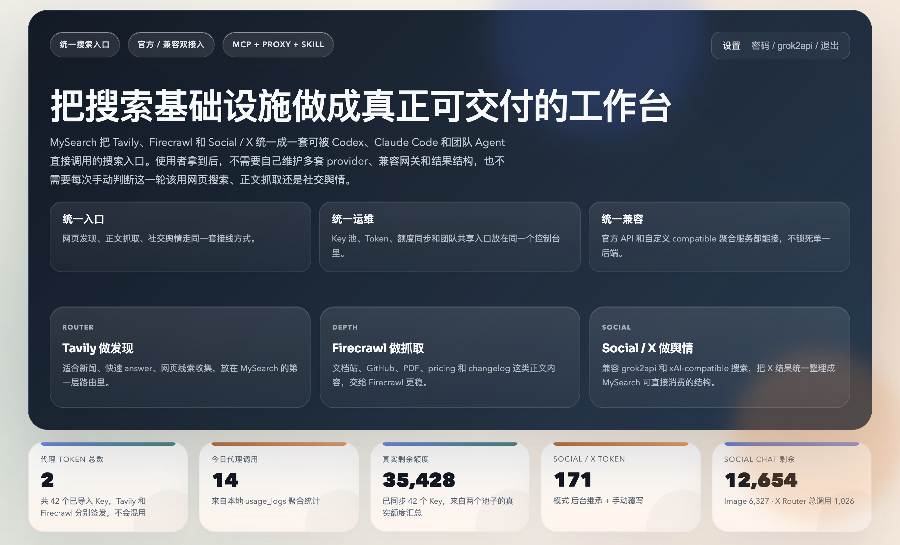
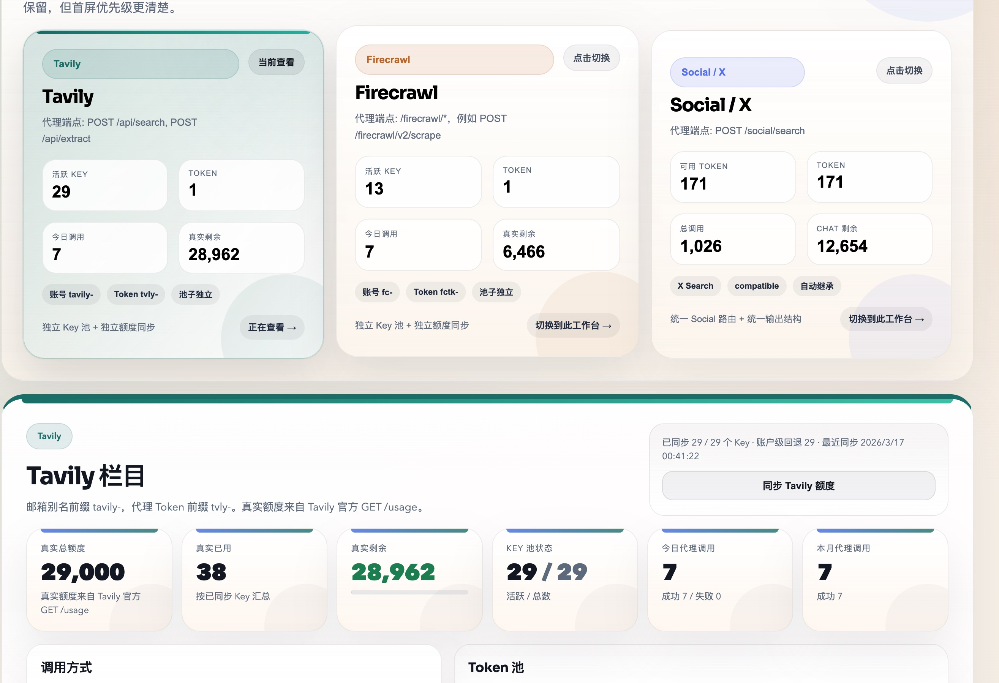

# MySearch Proxy Console

[English Guide](./README_EN.md) · [返回仓库](../README.md)

`proxy/` 是 MySearch 的控制台与代理层。

它不是单纯的 key 面板，而是整套 `proxy-first` 架构的中间层：

- 上游连 Tavily / Firecrawl / Exa / 可选 Social
- 下游给 MySearch MCP、OpenClaw skill 和其他 Agent 发统一 token
- 页面里同时看 key 池、token 池、调用统计和额度信息



## 它解决什么问题

如果没有 Proxy，常见问题会很散：

- 每台客户端都要单独填 provider key
- OpenClaw 和本地 Codex 的配置容易分叉
- token、额度、调用统计没有统一入口
- 上游 provider 一旦换地址，所有客户端都要跟着改
- Social / X 这条链很难跟 Web / Docs 搜索放在一个控制平面里

`MySearch Proxy` 的目标就是把这些收回来。

## 支持的能力

### Tavily

代理入口：

- `POST /api/search`
- `POST /api/extract`

控制台能力：

- key 池
- 429 按 `Retry-After` 临时冷却并自动换用其他 key；额度耗尽或明确鉴权失败会停用，需在控制台手工启用、替换或删除
- token 池
- 使用量同步
- 调用统计

补充说明：

- 如果上游是 `tavily-hikari`，控制台默认只读取公开的 `/api/summary`
- 只有补了 Hikari 的 admin 认证（ForwardAuth headers 或内建 admin cookie），控制台才会继续聚合 `/api/keys` 的 key / quota 细项
- [Tavily 官方错误响应](https://docs.tavily.com/documentation/api-reference/endpoint/search)：`401` 停用无效凭证，`432` 停用套餐额度受限 Key，`433` 停用按量付费额度受限 Key（`pay_as_you_go_limit`）。`429` 只按 `Retry-After` 冷却，未提供时沿用 60 秒默认值；`400/422/5xx` 不停用。
- 上游模式下 Key 池由 Hikari 等上游管理，MySearch 不会修改其 Key 或把额度不足误判为本地 `mysp-` Token 失效；额度失败返回上游池不可用 `503`。

### Firecrawl

代理入口：

- `POST /firecrawl/v2/search`
- `POST /firecrawl/v2/scrape`

控制台能力：

- key 池
- 429 按 `Retry-After` 临时冷却并自动换用其他 key；额度耗尽或明确鉴权失败会停用，需手工恢复
- token 池
- credits 同步
- 调用统计

Firecrawl 错误分类依据 [官方认证代码](https://github.com/firecrawl/firecrawl/blob/9ae2451b39dd986bddd9889d6693e8b79d273921/apps/api/src/controllers/auth.ts)、[额度与赞助验证代码](https://github.com/firecrawl/firecrawl/blob/9ae2451b39dd986bddd9889d6693e8b79d273921/apps/api/src/routes/shared.ts) 和 [请求错误码](https://github.com/firecrawl/firecrawl/blob/9ae2451b39dd986bddd9889d6693e8b79d273921/apps/api/src/lib/error.ts)：

- 验证过期 `sponsor_verification_expired`、未验证的 50 点额度用尽 `unverified_credit_limit_reached`、持有人封禁、账户封禁：停用当前 Key 并尝试其他 Key。控制台列表与详情显示原因、处理建议和脱敏上游信息；解决上游问题后需手动启用。
- 无效凭证、普通额度不足仍使用既有停用策略；普通 429 仅冷却。IP 白名单、接口/格式限制、目标网站拒绝、抓取/任务错误和临时服务故障不永久停用 Key，错误响应保留上游 code/error/message。
- 未识别的 403 不自动停用；本改动不扫描或恢复历史 Key，不新增数据库字段。额度同步错误仍单独展示，搜索/抓取请求的 Key 调度由代理池处理。

### Exa

代理入口：

- `POST /exa/search`

控制台能力：

- key 池
- 429 按 `Retry-After` 临时冷却并自动换用其他 key；额度耗尽或明确鉴权失败会停用，需手工恢复
- token 池
- 调用统计

说明：

- Exa 当前在控制台里支持接入和分发
- 实时官方额度暂时无法查询，所以页面会明确标注这一点
- [Exa 官方错误码](https://exa.ai/docs/admin/error-codes) 使用 HTTP 状态与 `tag` 联合判断：`401/INVALID_API_KEY`、`402/NO_MORE_CREDITS` 停用；`402/API_KEY_BUDGET_EXCEEDED` 和 `402/TEAM_BUDGET_EXCEEDED` 分别记录 Key/团队预算耗尽原因并停用。`429/RATE_LIMIT_EXCEEDED` 临时冷却。
- `403/FEATURE_DISABLED`、`PROHIBITED_CONTENT`、`CONTENT_FILTER_ERROR` 只影响当前功能或内容，不停用整把 Key；`X402_*`/`MPP_*` 支付错误不等同 API Key 额度耗尽。请求参数、服务过载和 `200` 响应里的单 URL 抓取失败也不永久停用。

三平台共用 `mysearch/errors.py` 的分类，Proxy 沿用 SQLite 持久化停用原因，直连 MySearch/OpenClaw 沿用进程内隔离至显式 reload。新规则在真实请求失败时触发，不回扫历史日志；界面显示中文原因与脱敏上游详情。更新不自动恢复已停用 Key，不改变 X 的既有调度规则。

### MySearch 通用 token

控制台能力：

- 创建 `mysp-` 开头的 MySearch token
- 一次接通 Tavily / Firecrawl / Exa
- 给 `mysearch/.env` 和 OpenClaw skill 直接复用
- 记录这类 token 的调用统计

当前策略：

- 默认关闭 token 小时 / 日 / 月限流
- token 只做鉴权与统计，不做配额拦截

### Social / X

代理入口：

- `GET /social/health`
- `POST /social/search`

控制台能力：

- 明确选择互斥的“本地模式”或“上游模式”
- 本地模式：独立 Base URL、Responses Path、本地 Social/X key 池轮询、可调度数量/隔离原因展示、单 key 立即恢复与整池替换
- 上游模式：上游 Base URL、client key 池和 grok2api Admin 对接；不会读取本地模式 Key
- gateway token 管理
- grok2api v3 管理员会话与 v2 legacy app key 对接
- v3 账号可用性、请求统计与 v2 token 状态展示

Social/X 模式保存在 Proxy 的 `settings` 表中。旧配置没有 `social_mode` 时，有 Admin 凭证默认进入上游模式，否则按本地模式兼容读取旧的 `social_upstream_api_key`。grok2api v3 的推理与管理凭据相互独立：`g2a_` client key 调用 `POST /v1/responses`；管理员用户名/密码只用于登录 `/api/admin/v1/auth/login` 并读取 `/accounts/summary`、`/dashboard`，不能替代 client key。

### 持续评测与自动选模

上游模式复用已有后台任务：每 6 小时一轮真实搜索评测，默认每 24 小时先调用 grok2api 的 `POST /api/admin/v1/models/sync`，必须收到 SSE `complete` 才记同步成功，然后分页读取模型目录。单轮最多 8 个候选、每次 40 秒、整轮 600 秒；主备优先，其余按最久未测试顺序轮换。三个固定搜索题目按轮次轮换，同轮所有模型用同题。同步会调用 grok2api 的全账号模型发现功能，账号很多时可能触及 180 秒同步预算；超时会明确记账，不冒充同步完成。

筛选保留 Grok 文本模型及 `Console/`、`Build/`、`Web/` 路由 ID，排除图像、视频、语音、嵌入等模型。HTTP 200 不代表搜索通过：必须有命名的 X 搜索工具调用、上游结构化 citation，且至少一条与引用匹配的帖子具有非空正文，只有引用的空壳结果不合格。使用与 `/social/search` 相同的提示词和结果归一化；不改用户显式指定的请求模型，不把 Tavily 降级计为 Grok 成功。只凭这些自动证据不能证明内容事实准确或完整相关。

管理目录失败时记录 `admin_catalog_failed` 并继续读取公共目录；目录漏报不能证明配置主备已下线，主备仍参加真实探测。目录降级有明确 warning，不等于同步成功。

选模窗口为最近 14 天、每模型最多 20 次：至少 3 次成功且成功样本跨 12 小时，成功率 ≥80%，最近一次成功且不超过 12 小时，成功响应 p90 ≤40 秒。合格者先比成功率，再比 p90；替换仍合格的主模型需成功率至少提高 10 个百分点，或成功率不降且 p90 至少降低 20%。无合格候选、整轮全失败或评测期间配置变化时保留现有主备。只有一个合格者时备用留空，不悄悄恢复内置备用。当前 `probe_version=2`；旧规则样本保留为 `unscored_samples`，不能用于新规则晋级，需重新积累观察窗口。

`timeout`、`network_socks`、`network_error`、鉴权/限流、上游错误和 `search_evidence_missing` 分开记录；网络失败降低该链路实用成功率，但不宣称模型本身无搜索能力，也不修改 OpenClash 或账号状态。统计存于现有 SQLite `settings.social_model_selection_state`，容器重启后保留；不保存响应正文或凭证。Linux/macOS 数据卷文件锁防止重复评测，主备与证据用单事务发布，配置变更做并发校验。

管理员可用 `GET /api/settings/social/models` 查看同步结果、逐轮探测与排名，`POST /api/settings/social/models/refresh` 立即触发一轮“同步→评测→选择”（需要为请求留出 600 秒；不会绕过跨时间样本门槛）。`SOCIAL_MODEL_REFRESH_TTL_SECONDS=0` 关闭自动同步与自动评测；手动触发仍可用。观察结果应至少覆盖几天，12 小时只是上线门槛，不是长期统计结论。旧的 `scripts/refresh_grok_models.py --apply` 是单次应急工具，不使用跨轮门槛，不应与自动评测同时运行。

同步协议依据：[grok2api 模型页调用](https://github.com/chenyme/grok2api/blob/7c889a960e2638341b4dae9a5c81af0e0f38c87f/frontend/src/entities/model/model-api.ts)、[同步接口](https://github.com/chenyme/grok2api/blob/7c889a960e2638341b4dae9a5c81af0e0f38c87f/backend/internal/transport/http/model/handler.go)。本功能不主动修改上游模型的启用状态或路由绑定。

独立质量实验可使用 `scripts/benchmark_grok_search.py`：在已配置 Proxy 环境中传 `--cases-json` 和 `--models` 捕获真实响应，或本地传 `--replay capture.jsonl` 离线重放。每轮最多 6 个题目/模型组合，单次 40 秒，401/403/429 立即中止该轮；输出公开题目的原始成功响应，勿用私人查询。不会写选模历史或主备配置。每轮应冻结新的题集，再看响应；旧题用于回归，不作为新题。`probe_ok` 只表示基本搜索交付，过滤检查另看 `constraint_violations` 和 `constraint_unknown`：匿名引用作者及模型自报日期不是独立验证证据，畸形响应按失败记录，不中断后续回放。

## 当前推荐用法

推荐你把它当成统一入口，而不是单独使用某一个 provider 工作台。

标准链路：

```text
上游 provider
  -> MySearch Proxy
     -> 生成 mysp- token
        -> MySearch MCP / OpenClaw skill / 其他 Agent
```

客户端只需要：

```env
MYSEARCH_PROXY_BASE_URL=https://your-mysearch-proxy.example.com
MYSEARCH_PROXY_API_KEY=mysp-...
```

## 控制台刷新性能（已优化）

为避免页面每次刷新都被远程额度同步拖慢，控制台现在默认采用：

- `/api/stats` 快速返回（短缓存）
- 额度同步改为手动触发（或后台节流同步）
- 写操作后前端会强制刷新，避免读到旧缓存

关键环境变量：

```env
STATS_CACHE_TTL_SECONDS=8
DASHBOARD_AUTO_SYNC_ON_STATS=0
DASHBOARD_BACKGROUND_SYNC_ON_STATS=1
DASHBOARD_BACKGROUND_SYNC_MIN_INTERVAL_SECONDS=45
```

说明：

- 如果你更看重“每次刷新都立刻拉最新额度”，可设 `DASHBOARD_AUTO_SYNC_ON_STATS=1`。
- 默认推荐保持 `0`，然后在页面点击“同步额度”按钮做显式刷新。

## 部署

### 方式 A：直接跑 Docker Hub 镜像

```bash
mkdir -p mysearch-proxy-data
export ADMIN_PASSWORD="$(openssl rand -base64 24)"

docker run -d \
  --name mysearch-proxy \
  --restart unless-stopped \
  -p 9874:9874 \
  -e ADMIN_PASSWORD="$ADMIN_PASSWORD" \
  -v $(pwd)/mysearch-proxy-data:/data \
  skernelx/mysearch-proxy:latest
```

访问：

```text
http://localhost:9874
```

### 方式 B：docker compose

```bash
cd proxy
docker compose up -d
```

### 方式 C：仓库根目录一套部署 `proxy + mysearch`

```bash
cd /path/to/MySearch-Proxy
docker compose up -d
```

这套 compose 现在会自动通过 `MYSEARCH_PROXY_BOOTSTRAP_TOKEN` 给 `mysearch` 创建或复用一个专用的 `mysp-` token，不需要再手动先创建 MySearch 通用 token 才能拉起远程 MCP。首次进入控制台后，仍然只需要补 provider 配置和 usage sync。

启动后：

- 控制台：`http://localhost:9874`
- MySearch MCP：`http://localhost:8000/mcp`

### 方式 D：单容器一体化镜像

```bash
export ADMIN_PASSWORD="$(openssl rand -base64 24)"
export MYSEARCH_PROXY_BOOTSTRAP_TOKEN="$(openssl rand -base64 32)"

docker run -d \
  --name mysearch-stack \
  --restart unless-stopped \
  -p 9874:9874 \
  -p 8000:8000 \
  -e ADMIN_PASSWORD="$ADMIN_PASSWORD" \
  -e MYSEARCH_PROXY_BOOTSTRAP_TOKEN="$MYSEARCH_PROXY_BOOTSTRAP_TOKEN" \
  -v $(pwd)/mysearch-proxy-data:/data \
  skernelx/mysearch-stack:latest
```

这个镜像会在同一个容器里同时启动 `proxy` 和 `mysearch`，并通过本地回环地址自动完成 token bootstrap。适合你更看重“部署步骤最少”而不是“服务边界最清晰”的场景。

默认情况下，`proxy` 会对外监听 `9874`，`mysearch` 会对外监听 `8000/mcp`；`mysearch` 自己仍然通过容器内 `127.0.0.1:9874` 回连 Proxy。

### 方式 E：本地源码运行

```bash
cd proxy
pip install -r requirements.txt
ADMIN_PASSWORD="$(openssl rand -base64 24)" uvicorn server:app --host 0.0.0.0 --port 9874
```

## 首次初始化建议

第一次打开页面后，按这个顺序做最稳：

1. 用 `ADMIN_PASSWORD` 登录控制台
2. 添加 Tavily / Firecrawl / Exa 的上游 key
3. 如果你要 Social / X，再补它的 upstream 配置
4. 执行一轮 usage sync
5. 创建 MySearch 通用 token
6. 把 `MYSEARCH_PROXY_BASE_URL` 和 `MYSEARCH_PROXY_API_KEY` 填给客户端

当前控制台已经带密码登录，不再适合匿名裸放在公网。

持久化目录现在统一建议挂到 `/data`。无论你跑独立 `mysearch-proxy` 还是单容器 `mysearch-stack`，都保持 `-v ...:/data`，不要再混用 `/app/data` 和 `/app/proxy/data`，否则升级重建容器时会像“数据丢失”，实际只是读到了另一份空 SQLite。

## 下游怎么接

### 给 `mysearch/` MCP

```env
MYSEARCH_PROXY_BASE_URL=https://your-mysearch-proxy.example.com
MYSEARCH_PROXY_API_KEY=mysp-...
```

### 给 OpenClaw skill

```json
{
  "skills": {
    "entries": {
      "mysearch": {
        "enabled": true,
        "env": {
          "MYSEARCH_PROXY_BASE_URL": "https://your-mysearch-proxy.example.com",
          "MYSEARCH_PROXY_API_KEY": "mysp-..."
        }
      }
    }
  }
}
```

## 页面与数据

控制台页面会按服务拆成独立区域：

- Tavily
- Exa
- Firecrawl
- Social / X
- MySearch 通用 token

这样做的目的是：

- 各服务额度不会混在一起
- token 不会串用
- 调用统计更清楚
- 下游接线一眼能看懂

界面预览：



默认数据目录：

- Docker compose
  - 宿主目录 `./data` 挂到容器内 `/data`
- `docker run` 示例
  - 宿主目录 `$(pwd)/mysearch-proxy-data` 挂到容器内 `/data`

## 认证与安全

关键环境变量：

```env
ADMIN_PASSWORD=<generate-a-strong-password>
ADMIN_SESSION_COOKIE=mysearch_proxy_session
ADMIN_SESSION_MAX_AGE=2592000
```

建议：

- 第一时间改掉默认管理员密码
- 放公网时务必配 HTTPS 反代
- 不要把生产上游 key 暴露到前端代码仓库
- 只把 `mysp-` token 发给下游客户端

## 支持的 API

管理和面板相关：

- `GET /`
- `GET /api/session`
- `POST /api/session/login`
- `POST /api/session/logout`
- `GET /api/stats`
- `GET /api/settings`
- `PUT /api/settings/social`
- `GET /api/keys`
- `POST /api/keys`
  - 兼容历史注册器请求：`{"service":"firecrawl","key":"fc-...","email":"account@example.com"}`
  - 批量导入继续使用：`{"service":"firecrawl","file":"email,password,fc-...,timestamp\\nfc-..."}`
  - 响应保留 `service`、`ok` / `imported`，并新增 `inserted`、`reactivated`、`duplicates`、`disabled`、`invalid` 等精确统计。
  - 历史失败阈值留下的无原因停用 Key 会在重传时恢复；手动、鉴权、额度/预算、验证或封禁原因的停用默认均保持，可传 `"reactivate": true` 显式恢复。
  - 默认沿用管理员 session、`X-Admin-Password` 或管理员 Bearer；配置 `MYSEARCH_PROXY_KEY_UPLOAD_TOKEN` 后，注册器也可仅带 `X-Key-Upload-Token`，该 Token 不可用于其他管理 API。
  - 单条上传保留历史 opaque gateway credential 兼容；批量文本仍按 Provider Key 格式筛选。

注册器使用专用上传凭证时：

```bash
curl http://localhost:9874/api/keys \
  -H 'Content-Type: application/json' \
  -H 'X-Key-Upload-Token: your-registrar-token' \
  -d '{"service":"firecrawl","key":"fc-...","email":"account@example.com"}'
```

- `GET /api/tokens`
- `POST /api/tokens`
- `POST /api/usage/sync`

搜索代理相关：

- `POST /api/search`
- `POST /api/extract`
- `POST /firecrawl/v2/search`
- `POST /firecrawl/v2/scrape`
- `POST /exa/search`
- `GET /social/health`
- `POST /social/search`

## 什么时候看别的文档

- 你要安装 MCP：
  看 [../mysearch/README.md](../mysearch/README.md)
- 你要给 AI 安装 skill：
  看 [../skill/README.md](../skill/README.md)
- 你要装 OpenClaw bundle：
  看 [../openclaw/README.md](../openclaw/README.md)
